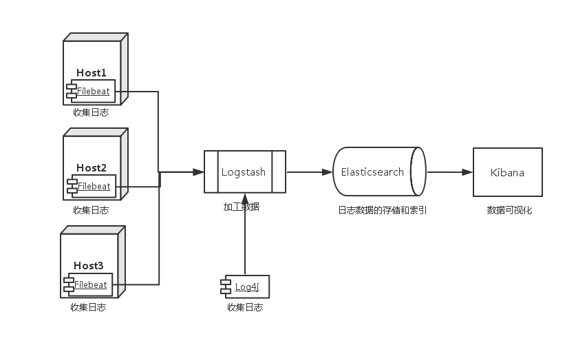
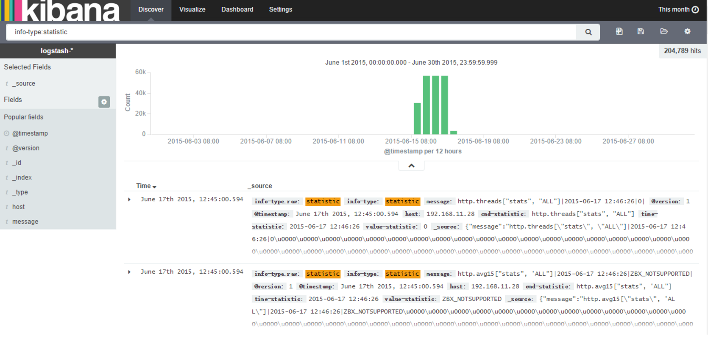

## 用 ELK Stack 和 Docker 搭建日志平台


> Elasticsearch, Logstash 和 Kibana (即我们所说的 “ELK” Stack) 具有对任何来源的数据进行可视化的能力。
>
> Docker是一个开源的引擎，可以轻松的为任何应用创建一个轻量级的、可移植的、自给自足的容器。开发者在笔记本上编译测试通过的容器可以批量地在生产环境中部署，包括VMs（虚拟机）、bare metal、OpenStack 集群和其他的基础应用平台。

## 1. 架构

这次我们 ELK Stack 搭建一个日志平台，运行在 Docker 中，并配合 Filebeat 及 Log4j，收集系统日志、nginx 访问日志和 Java 由 Log4j 产生的日志，总体的架构图如下：




其中我们用 Elasticsearch 作为日志的存储和索引平台；Logstash 依靠强大繁多的插件作为日志加工平台，Kibana 用来从 Elasticsearch 获取数据，进行数据可视化，定制数据报表；Filebeat 用来放到各个主机中收集指定位置的日志，将收集到日志发送到 Logstash；Log4j 直接与 Logstash 连接，将日志直接发送到 Logstash（当然此处也可以用 Filebeat 收集 tomcat 的日志）。

## 2. Elasticsearch 配置

Elasticsearch 作为日志的存储和索引平台，他的 docker-compose 配置文件如下：

```
version: '2'
services:
  elasticsearch:
    image: elasticsearch:2.2.0
    container_name: elasticsearch 
    restart: always
    network_mode: "bridge"
    ports:
      - "9200:9200"
      - "9300:9300"
    volumes:
       - ./data:/usr/share/elasticsearch/data
```

其中，主机向外暴露的端口 `9200` 作为 对外提供服务的 HTTP 端口；`9300` 作为交互的 TCP 端口；
**将日志索引文件的存储目录挂载到主机的目录，防止因容器挂掉活重启导致历史日志文件丢失。**

配置好 `docker-compose.yml` 文件后, 运行 `docker-compose up -d` 便以 daemon 方式启动。用 `docker ps` 命令查看启动状况.

## 3. Logstash 配置

Logstash 作为日志的加工处理平台，有很多的插件可以配置，他的 docker-compose 配置文件如下：

```
version: '2'
services:
  logstash:
    image: logstash:2.2.0-1
    container_name: logstash 
    restart: always
    network_mode: "bridge"
    ports:
      - "5044:5044"
      - "4560:4560"
      - "8080:8080"
    volumes:
      - ./conf:/config-dir
      - ./patterns:/opt/logstash/patterns
    external_links:
      - elasticsearch:elasticsearch
    command: logstash -f /config-dir
```

其中暴露的端口 `5044` 用于接收来着 Filebeat 收集的日志数据； `4569` 用于接收来着 Log4j 的日志数据；`8080` 用于接收来自插件 Logstash-input-http 的日志数据；

挂载 `conf` 目录，用于添加我们自定义的配置文件，`patterns` 用于添加我们自定义的 grok 规则文件。

同时，和 `elasticsearch` 容器连接用来传送数据。

配置好 `docker-compose.yml` 文件后, 运行 `docker-compose up -d` 便以 daemon 方式启动。用 `docker ps` 命令查看启动状况.

## 4. Filebeat 配置

Filebeat 安装在每一个需要收集日志的主机上收集指定的日志，他的 docker-compose 配置文件如下：

```
version: '2'
services:
  filebeat:
    image: olinicola/filebeat:1.0.1 
    container_name: filebeat 
    restart: always
    network_mode: "bridge"
    extra_hosts:
      - "logstash:127.0.0.1"
    volumes:
      - ./conf/filebeat.yml:/etc/filebeat/filebeat.yml
      - /data/logs:/data/logs
      - /var/log:/var/host/log
      - ./registry:/etc/registry
```

其中以 `extra_hosts` 的方式，指定 Logstash 的位置；挂载配置文件目录 `conf`；挂载本机的日志目录 `/data/logs`; 挂载本机的系统日志目录 `/var/log`; **挂载 `registry` 目录，用来确定 Filebeat 读取文件的位置，防止 Filebeat 因重启或挂机导致又从头开始读取日志文件，造成日志数据重复。**

## 5. Kibana 配置

Kibana 的配置最为简单，仅作为数据可视化的平台，提供 HTTP 访问服务即可。他的 docker-compose 配置文件如下：

```
version: '2'
services:
  kibana:
    image: kibana:4.4.0
    container_name: kibana 
    restart: always
    network_mode: "bridge"
    ports:
      - "5601:5601"
    external_links:
      - elasticsearch:elasticsearch
```

其中连接到 `elasticsearch` 容器用来获取数据；暴露 `5601` 端口用于 Kibana 界面的访问；

配置好 `docker-compose.yml` 文件后, 运行 `docker-compose up -d` 便以 daemon 方式启动。用 `docker ps` 命令查看启动状况.

打开 `http://your-host:5601` 即可看到 Kibana 的界面，大致如下图的样子：



## 6. 使用配置

### (1) nginx 访问日志格式配置

在 nginx 配置文件中配置如内容：

```
log_format  logstash  '$remote_addr - $remote_user [$time_local] 
request" '
              '$status $body_bytes_sent "$http_referer" '
              '"$http_user_agent" "$http_x_forwarded_for" '
              '"$http_host" "$upstream_addr" '
              '$request_time $upstream_response_time';
access_log  /data/logs/nginx/access.log  logstash;
```


### (2) Log4j 的接入配置

在 `log4j.properties` 文件中配置如下内容：

```
log4j.rootLogger = INFO,logstash
# Push to Logstash
# 注意：RemoteHost 等信息可能变化，根据具体情况配置
log4j.appender.logstash=org.apache.log4j.net.SocketAppender
log4j.appender.logstash.Port=4560
log4j.appender.logstash.RemoteHost=your-logstash-host
log4j.appender.logstash.ReconnectionDelay=60000
log4j.appender.logstash.LocationInfo=true
```
